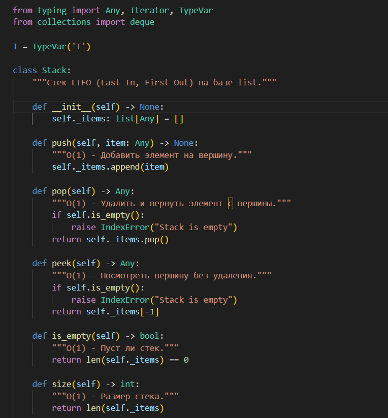
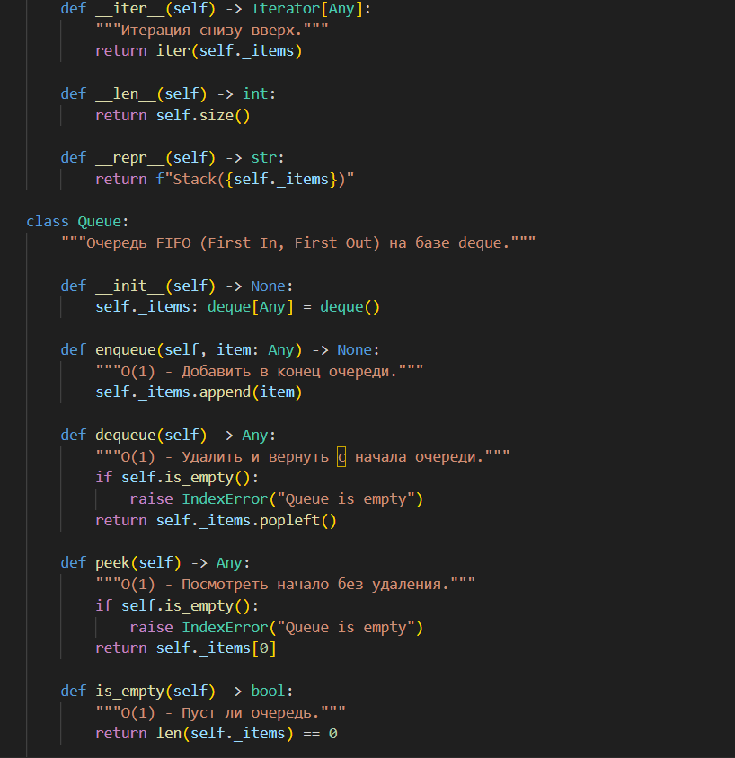
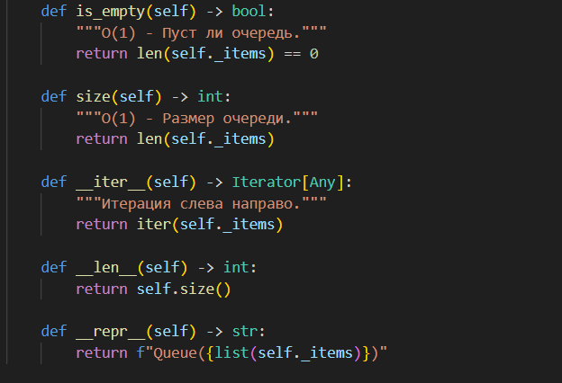
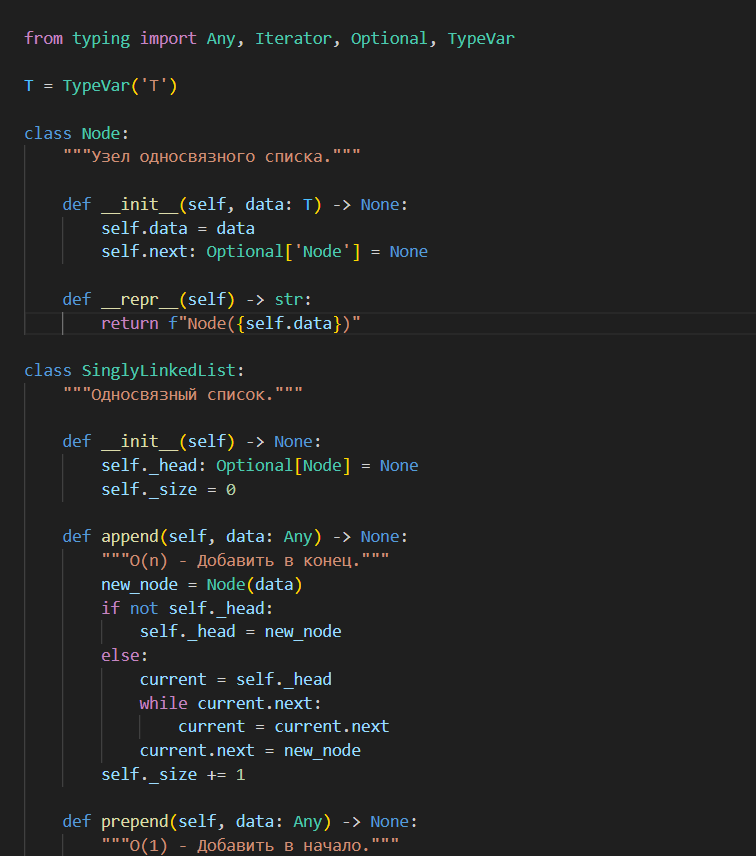
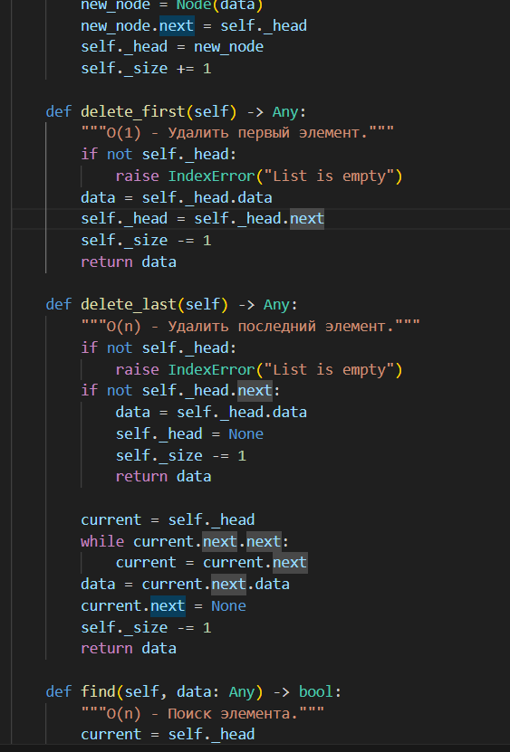
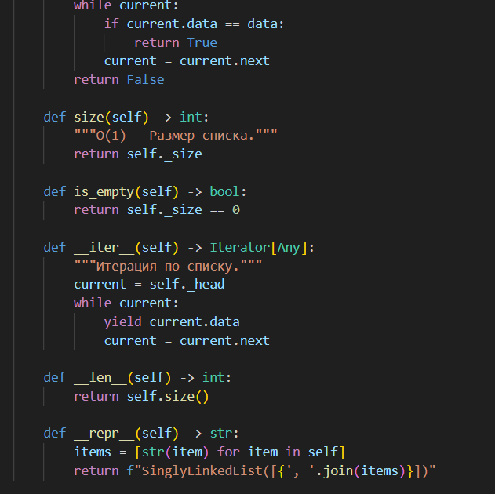
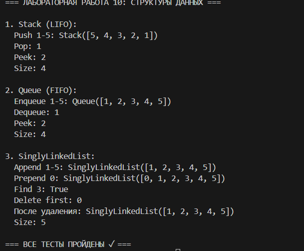

# это десятая лаба

# Теория

Стек (Stack) работает по принципу LIFO (Last In, First Out) — последний вошел, первый вышел. Типичные операции: push (добавление) и pop (удаление) имеют сложность O(1). Используется для истории браузера "Назад", undo в редакторах, вызовов функций.

Очередь (Queue) работает по принципу FIFO (First In, First Out) — первый вошел, первый вышел. Операции enqueue (добавление в конец) и dequeue (удаление с начала) также O(1). Применяется в планировщиках задач, очередях печати, алгоритме BFS.

Связный список (Linked List) состоит из узлов, каждый содержит данные и ссылку на следующий. Добавление в начало prepend O(1), удаление первого delete_first O(1), но добавление в конец append и поиск find имеют сложность O(n), так как нужно пройти весь список.
# Реализация

Stack реализован на базе list с методами push, pop, peek, is_empty, size — все операции O(1). Пример: stack = Stack(); stack.push(1); stack.push(2); print(stack.pop()) выведет 2.

Queue реализован на collections.deque с методами enqueue, dequeue, peek — оптимально для FIFO. Пример: queue = Queue(); queue.enqueue(1); queue.enqueue(2); print(queue.dequeue()) выведет 1.

SinglyLinkedList содержит класс Node и методы append (O(n)), prepend (O(1)), delete_first (O(1)), delete_last (O(n)), find (O(n)). Пример: llist = SinglyLinkedList(); llist.append(1); llist.prepend(0); print(list(llist)) выведет [0, 1].

Stack на list идеален для LIFO операций благодаря O(1) доступу к концу. Queue на deque быстрее всего для FIFO благодаря оптимизированным операциям с обоих концов. LinkedList проигрывает в скорости append из-за необходимости прохода всего списка O(n), но выигрывает при частых вставках/удалениях в начало O(1).

list быстрее всего для Stack, deque оптимизирована для Queue, LinkedList подходит только для специфических случаев с частыми операциями в начале списка.

# задание 1:

# задание 2:

# тест

